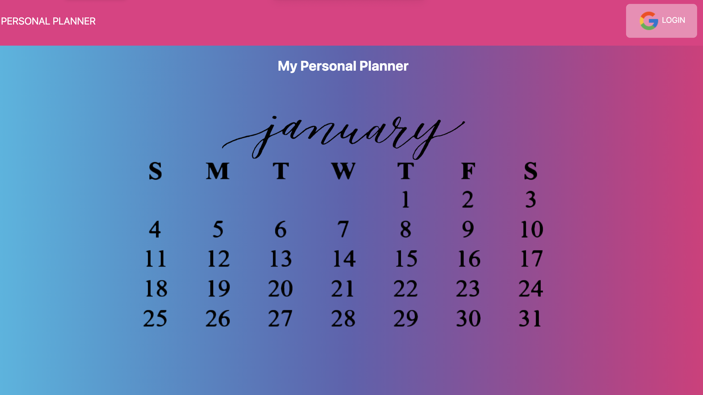
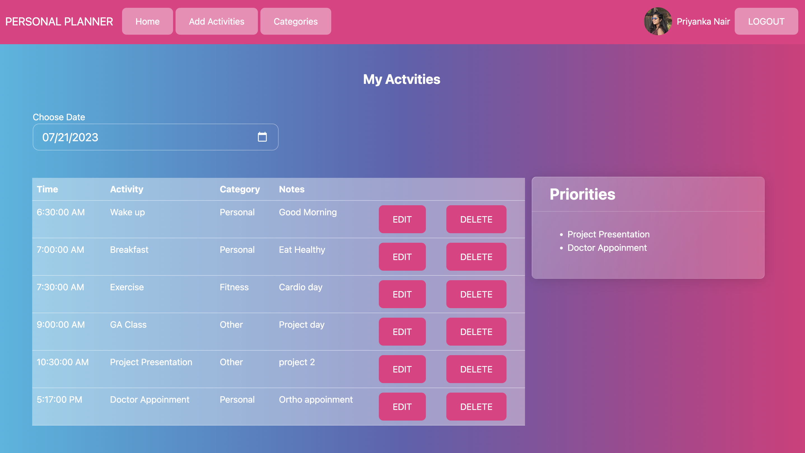

PERSONAL PLANNER

There are a lot of common, beneficial reasons why people use planners to keep their lives in check. Planners help you know what to expect, they help you set reasonable goals with achievable measurements, and you’ll never miss another deadline again. You may find though, that these obvious reasons aren’t enough to help you maintain a planner. Sometimes the unusual benefits of keeping a planner help you move forward more than the usual ones.
Personal Planner is a simple calender application that allows the user to plan and track day to day activities,save events for each hour of the day. The app runs in the brower and stored the data in database.

Features includes :-

1-Login required with google account.
2- Personal Planner home page to manage daily activities.
3-option to add activities.
4-option to edit/update activity.
5-option to delete activity.
6-Everything displayed in post login home page and option to filter with date.
7-User can view  priority list of activities as separate list.

LINK TO TRELLO:-
https://trello.com/b/GpNemfEI/project-2-personal-planner

SCREENSHOTS;-

Technologies Used:-

1-HTML
2-CSS
3-BOOTSTRAP
4-JAVASCRIPT
5-EXPRESS
6-NODE JS
7-MONGO DB
8-EJS -To render HTML Templates
9-HEROKU-For Deployment

GETTING STARTED:-
https://gentle-stream-12815-b8cf5b89c2bf.herokuapp.com

NEXT STEP:- Future Enhancements
1-Able to view weekly/monthly plans in homepage.
2-Adding reminder for upcoming events.
3-Add Fitness and Health Tracker